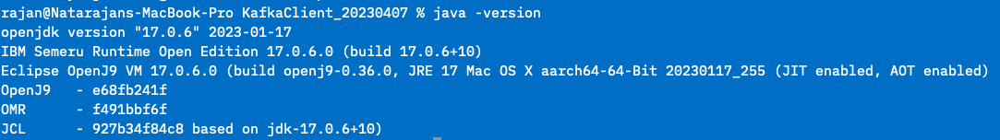
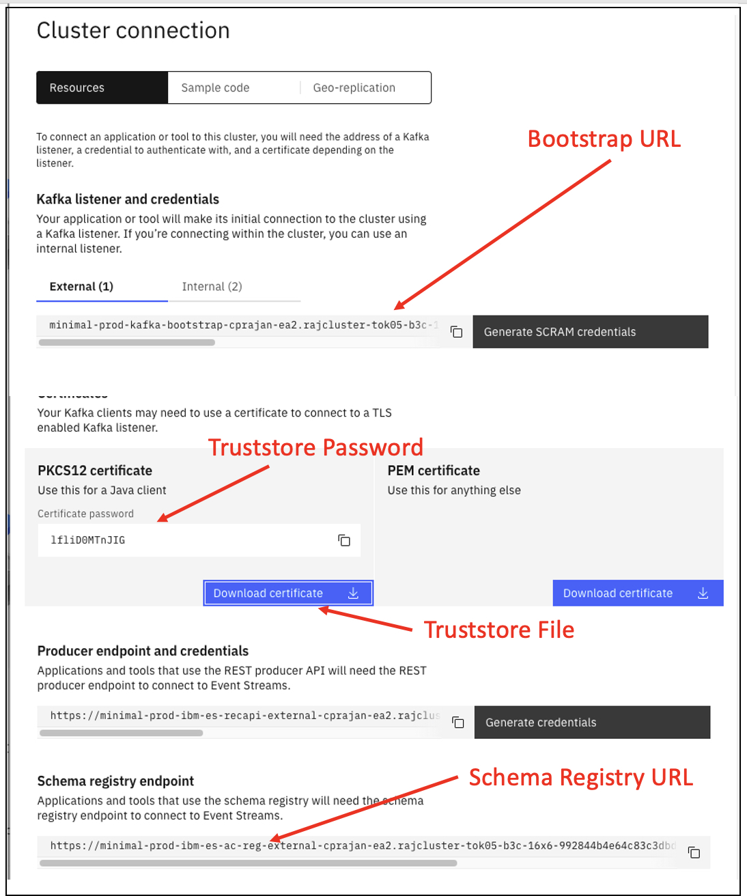

# Producing & Consuming Data with Event Streams

## Lab Objective

In this lab, we’ll do the following: 

* Create a topic.   
* Create a Kafka User with appropriate rights to produce and consume data
* Gather information needed to connect to the Kafka cluster.
* Test producing / consuming data.


You will run producer and consumer apps on your laptop, and they will contact brokers using SCRAM authentication and TLS encryption.

## Setting Up The Client Machine

Setting up the sample Kafka Client to be used for the lab.

This section provides the instructions for setting up the Kafka Client that will be used throughout the labs.

1. Check java install

    ```sh
    C:\Users\rajan>java -version
    At least version 17.0 should be available.
    ```

    

	If it’s not installed, download and install the Java Runtime. Use the [IBM Semeru Runtimes Download site to download Java](https://developer.ibm.com/languages/java/semeru-runtimes/downloads/)

2.	Download the sample Kafka Client code from here:  [https://github.com/ibm-cloud-architecture/eda-tech-academy/blob/main/tech-jam/KafkaClient_20230407.zip](https://github.com/ibm-cloud-architecture/eda-tech-academy/blob/main/tech-jam/KafkaClient_20230407.zip). 

3.	Unzip the downloaded Kafka Client (KafkaClient_YYYYMMDD.zip) into a folder: 

    ```sh
    C:\TechJam\EventStreams_Lab\
    unzip KafkaClient_20230407.zip 
    ```

4.	Test the client: Open a Command Prompt.

    ```sh
    cd C:\TechJam\EventStreams_Lab\KafkaClient_20230407\
	java -jar KafkaClient.jar
    ```


## Pre-Requisites

* Have setup the client machine properly. 
* Able to access the Event Streams web interface. 


## Lab Procedures


### Creating a topic.

1. Click on one of the links below (depending on the OpenShift cluster allocated to you) to log into your Event Streams instance using the student credentials provided. Once you've logged in, you'll see the Event Streams homepage.


    | Host | URL |
    | --- | --- |
    | Ventress | [https://cpd-cp4i.apps.ventress.coc-ibm.com/integration/kafka-clusters/event-automation/my-kafka-cluster/](https://cpd-cp4i.apps.ventress.coc-ibm.com/integration/kafka-clusters/event-automation/my-kafka-cluster/) |
    | Melch| [https://cpd-cp4i.apps.melch.coc-ibm.com/integration/kafka-clusters/event-automation/my-kafka-cluster/](https://cpd-cp4i.apps.melch.coc-ibm.com/integration/kafka-clusters/event-automation/my-kafka-cluster/) |
    | POE | [https://cpd-cp4i.apps.poe.coc-ibm.com/integration/kafka-clusters/event-automation/my-kafka-cluster/](https://cpd-cp4i.apps.poe.coc-ibm.com/integration/kafka-clusters/event-automation/my-kafka-cluster/) |  

    

2. Create Topic.

    Click on Create a Topic. Use only lower cases for the topic name. Use your student id as pefix for the topic.  (e.g. `ventress20-customers`).

    

    Please refer to screenshots attached as sample. 

    


## Creating a Kafka User with appropriate rights.


1.	Go to the Event Streams home page. **Select** “Connect to this Cluster” -> Generate SCRAM Credentials.
 
     
    
    

    Refer to the screenshot attached as reference. 

 
    

    Take note of the SCRAM user and the SCRAM password. 

## Gather Connection Details

Creating connection from Consumer / Producer requires some connectivity details. These details can be gathered from the Event Stream’s portal. Connectivity details needed will depend on type of authentication and SASL mechanism used. 

From the Event Stream home page, click on “Connect to this Cluster”.  Get the following information from the page. Refer to screenshot below on how to get these.

. Bootstrap URL   
. Truststore Certificate File. Copy the downloaded file to the Kafka Client folder.   
. Truststore Password. (Password will be generated once Download Certificate is clicked).   




## Test Producer / Consumer

1.	Prepare the `config.properties` file located in `C:\TechJam\EventStreams_Lab\KafkaClient_20230407\`.  Make a copy of the config.properties (for example, call it config.properties.lab1) Check and change the following fields. The fields not mentioned here can be left default. 

    | Field	| Value |
    | --- | --- |
    |enableschemaavro	| false (as we have schema attached to the topic) |
    | bootstrap.servers	| Enter the URL obtained in previous section e.g. es1-kafka-bootstrap-cp4i.apps.ocp46.tec.uk.ibm.com:443 |
    | sasl.jaas.config	| Paste this string. Replace the Username and Password.  org.apache.kafka.common.security.scram.ScramLoginModule required username='<SCRAM_USER>' password='<SCRAM_PASSWORD>'; |
    | sasl.mechanism	| SCRAM-SHA-512 |
    | security.protocol	 |SASL_SSL |
    | topic	| Topic created previously. E.g. jam60-topic1 |
    | group.id	| Enter a Consumer Group ID. You can enter a Consumer Group. Remember that it should have a prefix of your studentID. E.g. jam60-consumer-group-v1 |
    | ssl.truststore.location | Should point to the Truststore certificate downloaded. Example:  ./es-cert.p12 |
    | ssl.truststore.password | Enter the Truststore password obtained. |


    This is how your `config.properties.lab1` should look like after the changes. This is a sample. Do not copy and paste this contents. 

    ```sh
	## Mandatory Section ##
	# Set to true if avro schema is enabled for the topic
	enableschemaavro = flase
	# Set to true if want to enable Intercept Monitoring.
	enableintercept = false
	# Set this to true if mTLS (2-way TLS authentication) is enabled.
	enablemtls = false
	# Broker related properties
	bootstrap.servers = es-demo-kafka-bootstrap-cp4i-eventstreams.apps.cody.coc-ibm.com:443
	sasl.jaas.config = org.apache.kafka.common.security.scram.ScramLoginModule required username='cody200-sr-user' password='EelwRR1';
	# Example: sasl.jaas.config = org.apache.kafka.common.security.scram.ScramLoginModule required username='student01' password='B9BmjHvJZC';
	# Options are PLAIN, SCRAM-SHA-512, GSSAPI
	sasl.mechanism=SCRAM-SHA-512
	# Options are SSL, PLAINTEXT, SASL_SSL, SASL_PLAINTEXT
	security.protocol=SASL_SSL
	topic=cody200-sr
	# Consumer Group ID
	group.id = cody200-group1
	# Example: group.id = student01-group
	client.id=302071b2-7daf-4844
	#--------------------------------
	## To be filled in if TLS is enabled for the Brokers
	# Options are PKCS12, JKS, PEM. Password not required for PEM.
	ssl.truststore.type=PKCS12
	ssl.truststore.location=./es-cert.p12
	ssl.truststore.password=luONbNsf
	#--------------------------------
	## To be filled if mTLS (Mutual TLS) is enabled in Brokers
	ssl.keystore.location=/home/rajan/load_security/kafka.client.keystore.jks
	ssl.keystore.password=clientpass
	ssl.key.password=clientpass
	#-------------------------------
	## To be filled in if Schema is enabled
	apicurio.registry.url = https://es-demo-ibm-es-ac-reg-external-cp4i-eventstreams.apps.cody.coc-ibm.com
	# To be set to true if schema is not created up front.
	auto.register.schemas=false
	## To be filled in if Schema Registry requires Authentication.
	basic.auth.credentials.source = USER_INFO
	schema.registry.basic.auth.user = cody200-sr-user
	schema.registry.basic.auth.password = EelwRR1
	#--------------------------------
	## To be filled in if TLS is enabled for Schema Registry
	schema.registry.ssl.truststore.type=PKCS12
	schema.registry.ssl.truststore.location=./es-cert.p12
	schema.registry.ssl.truststore.password=luNbNsf
	#--------------------------------
	## To be filled if Consumer / Producer Intercept should be turned on
	intercept_bootstrapServers = es3minimal-kafka-bootstrap-es3.mycluster-rajan07-992844b4e64c83c3dbd5e7b5e2da5328-0000.jp-tok.containers.appdomain.cloud:443
	intercept_sasljaas = org.apache.kafka.common.security.scram.ScramLoginModule required username='rajan' password='CfKQZG9Cm7g5';
	intercept_security = SASL_SSL
	intercept_saslmechanism = SCRAM-SHA-512
	#--------------------------------
	## To be used when Kerberos Authentication is used
	sasl.kerberos.service.name=kafka
	#--------------------------------
	## Other Optional parameters.
	retries = 2

    ```

2. Test producing message. 

    Go to this folder in command prompt:
    
    ```sh
    cd C:\TechJam\EventStreams_Lab\KafkaClient_20230407\ 
    java -jar KafkaClient.jar producer 10 config.properties.lab1
    ```

    Check if the message is listed in the topic. In the Event Streams portal, go to Topics. Look for the topic that you created. Click on it. Then click on messages.  You should see the messages produced. 

    !!! Warning
        The messages content may not be displayed correctly in the portal due to binary serialization with Avro.
    
    { width="1200" }

3. Test consuming message. 

    ```sh
    java -jar KafkaClient.jar consumer config.properties.lab1
    ```

    Messages should be consumed correctly.  Message content should be displayed correctly. Press CTRL-C to stop the consumer. 

  
    { width="1200" }


!!! success "Congratulations!" You've completed the Basic Event Streams lab. You now know how to create topic, how to cretae kafka-users and how to gather connection details.  

