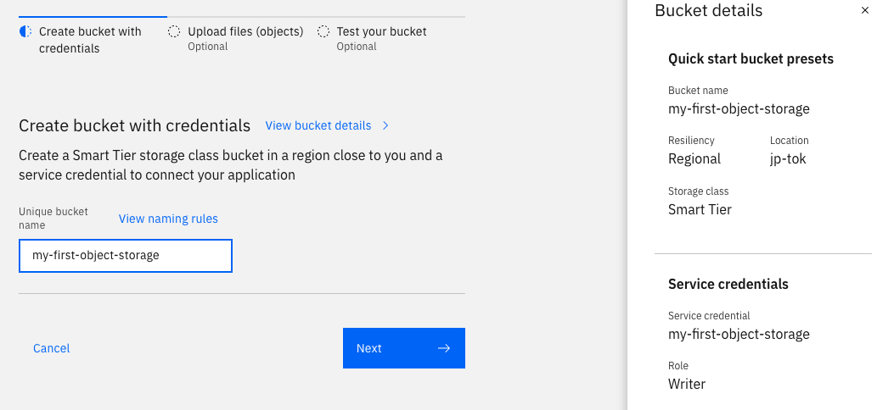

# Creating a ICOS Bucket in IBM Cloud

## Objective
1. To create a S3 bucket in IBM Cloud (for testing purposes)
2. To create access key and secret that can be used to access the bucket
3. To obtain connectivity details.

## Procedure
### Create Object Storage and Bucket
1. Login to [IBM Cloud](https://cloud.ibm.com/) using your IBM ID. 
2. Open the [Catalog](https://cloud.ibm.com/catalog).  
3. Look for 'Object Storage' and click on it.  
.  

1. Choose the Lite (free) Plan and click on create. Your object storage instance will be created in a few minutes.        
2. Then, go to the [Resource List](https://cloud.ibm.com/resources)
3. Click on Storage -> Click on the the newly created Object Storage.   
4. In the next screen Click on "Create Bucket" -> 'Quickly get started'.  
5. Enter the bucket name (follow naming rules) and take note of it. Click Next. The bucket will be created.    
.  

### Create Access Key and Secret

1. Go to the [Resource List](https://cloud.ibm.com/resources)
2. Click on Storage -> Click on the the newly created Object Storage.
3. Click on 'Service Credentials' -> New Credentials.  
Give it any name.   
For Role - select 'Writer'.   
Turn on HMAC Credentials. This is needed to create access key / secret as needed by most S3 compatible object storages.   
Click on Add.   

4. The newly created Service Credential should be listed. Click on it to get the access key and secret. Take note of the access key and secret.  

  

### Get the End Point to connect.

1. Go to the [Resource List](https://cloud.ibm.com/resources)
2. Click on Storage -> Click on the the newly created Object Storage -> Click on Configuration.   
3. Scroll down and look for Public Endpoint. Take note of the endpoint.   
.  

### Whats next?
1. Now you are ready to use the S3 storage with any application - ACE, Aspera, EventStream Connectors etc.  
2. You should have the public endpoint, bucket name, access key and secret with you.   
3. Go to the [Resource List](https://cloud.ibm.com/resources)
4. Click on Storage -> Click on the the newly created Object Storage.
5. Click on the newly created bucket.   
6. When you application start uploading data into object storage, you should see them appear in this page.  

