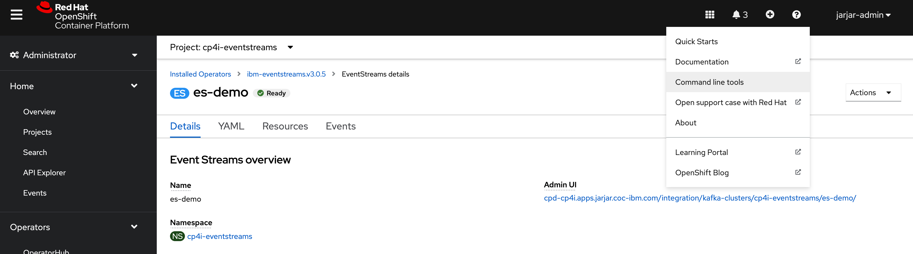
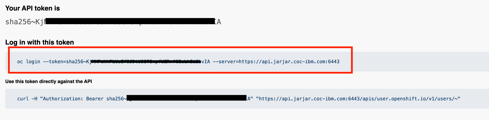
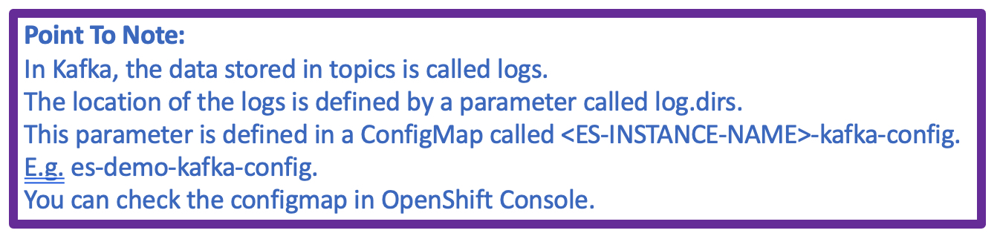
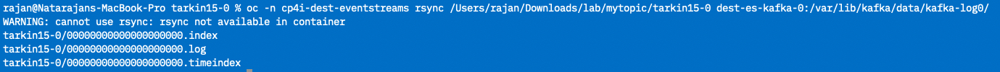

# LAB - Backup EventStreams By Copying Logs Folder

## Objective
Make a backup of a source Event Streams topic by copying its log folder.  

## Pre-requisite

1. Access to login to a OpenShift Console. Depending on your student-id, your OpenShift Console will be:

	| User ID  | OpenShift Console  |
	|---|---|
	| tarkin  | [https://console-openshift-console.apps.tarkin.coc-ibm.com/](https://console-openshift-console.apps.tarkin.coc-ibm.com/)  |
	|  wedge | [https://console-openshift-console.apps.wedge.coc-ibm.com/](https://console-openshift-console.apps.wedge.coc-ibm.com/)  |
	|  obi-wan |  [https://console-openshift-console.apps.obi-wan.coc-ibm.com/](https://console-openshift-console.apps.obi-wan.coc-ibm.com/) |
	|  jarjar |  [https://console-openshift-console.apps.jarjar.coc-ibm.com/](https://console-openshift-console.apps.jarjar.coc-ibm.com/) |.  
	
	
	Log-in to your Openshift console.  Change to the "Administrator Portal".   
	
  
2. Install the CLIs in your laptop.

   Click on Help (question-mark symbol) and Click on "Command line tools".   
   
   
   Download the appropriate version for your operating system.    
   
		   Test:  oc version
   
   Download and install kubectl from [here](https://kubernetes.io/docs/tasks/tools/).   
   

1. Access to a EventStreams portal. Depending on your student-id, your EventStreams Portal will be:

	| UserID  |  EventStreams Portal |
	|---|---|
	|  tarkin | [https://es-demo-ibm-es-ui-cp4i-eventstreams.apps.tarkin.coc-ibm.com/](https://es-demo-ibm-es-ui-cp4i-eventstreams.apps.tarkin.coc-ibm.com/)  |
	| wedge  |  [https://es-demo-ibm-es-ui-cp4i-eventstreams.apps.wedge.coc-ibm.com/](https://es-demo-ibm-es-ui-cp4i-eventstreams.apps.wedge.coc-ibm.com/) |
	| obi-wan  | [https://es-demo-ibm-es-ui-cp4i-eventstreams.apps.obi-wan.coc-ibm.com/](https://es-demo-ibm-es-ui-cp4i-eventstreams.apps.obi-wan.coc-ibm.com/)  |
	| jarjar  |  [https://es-demo-ibm-es-ui-cp4i-eventstreams.apps.jarjar.coc-ibm.com/](https://es-demo-ibm-es-ui-cp4i-eventstreams.apps.jarjar.coc-ibm.com/) |

	Login to the EventStream Portal. At the point where you need to choose the "Authentication Type" -> Choose "Enterprise LDAP" and login with the same credentials as the one used for OpenShift Console.   
	Upon login, check if a topic that has the same name as your login-id exists in the list.   

3. Access to a backup EventStreams Cluster.   
   For the purpose of this lab, you will be provided access to a common cluster.  
   

## Backup from Source EventStreams

1. Create a local working folder in your laptop.   
	> mkdir /Users/rajan/Downloads/lab/mytopic/  

1. Copy login command from Openshift Console.    
   While logged in to Openshift Console, Click on your username and click on "Copy Login Command".   
   .  
   
   Enter your credentials (if asked), then, click on "Display Token".  Copy the "Login with this token" string.   
       
   
	Paste the string in Terminal / CMD / PowerShell terminal. You should be logged in and be able to see the projects that you have access to.   
	
	.  
	
1. 	Check for files in the broker.

	Use this command to check the files related to your topic.     

	oc -n \<NAMESPACE> exec -it \<KAFKA-POD-NAME> -c kafka -- ls -lrt /var/lib/kafka/data/kafka-log\<BROKER-ID>/\<USER-ID>-\<PARTITION-ID>.   
	> NAMESPACE = cp4i-eventstreams.  
	> KAFKA-POD-NAME = es-demo-kafka-0.  
	> BROKER_ID = 0   
	> USER-ID = YOUR USER-ID.
	> PARTITION-ID = 0 [topic only has a single partition].   
	
	Example:   
	
		oc -n cp4i-eventstreams exec -it es-demo-kafka-0 -c kafka -- ls -lrt /var/lib/kafka/data/kafka-log0/jarjar17-0/
	
	
	
	.  

1. Copy the files of the topic to your laptop.   
	Command: oc -n \<NAMESPACE> rsync \<KAFKA-POD-NAME>:/var/lib/kafka/data/kafka-log\<BROKER-ID>/\<USER-ID>-\<PARTITION-ID> /Users/rajan/Downloads/lab/mytopic/.
	
	Example of command.   
	
		oc -n cp4i-eventstreams rsync es-demo-kafka-0:/var/lib/kafka/data/kafka-log0/jarjar17-0 /Users/rajan/Downloads/lab/mytopic/.

	*Ignore any "rsysnc not available in container" errors.   
	If you see "unexpected EOF" errors, simple re-run the same command again.   *.  
	If the copying was successful, you should see something like this.   
	.  
	
1. **IMPORTANT:**	Filter unwanted files in the backed up folder.   
	"oc rsync" does not provide a mechanism to filter files that needs to be copied. So, it has to be done manually. Files like checkpoint and metadata will be created by Kafka as needed. So, delete them.    
	In the backup folder,  you should only have file with the following extension:   
	
		*.index.  
		*.log.  
		*.timeindex.   
		   
	
## Restore Files to Destination Kafka
	
1. 	Restore the copied files in a different EventStreams Cluster.   
	Before restoring the files, we need to have access to copy files into the destination EventStreams. The 'oc login' command will be provided during the lab (in slack).  
	
	
1. 	The next step will be to restore the copied files into another EventStreams cluster.    
	For the lab, we will copy your topic to another EventStreams under a common namespace.     
	Command:
`oc -n <DEST-NAMESPACE> rsync /Users/rajan/Downloads/lab/mytopic/<USER-ID>-<PARTITION-ID> <KAFKA-POD-NAME>:/var/lib/kafka/data/kafka-log<BROKER-ID>/  `.  

	> DEST-NAMESPACE = cp4i-dest-eventstreams.  
	> KAFKA-POD-NAME = dest-es-kafka-0.  
	> BROKER_ID = 0   
	> USER-ID = YOUR USER-ID.
	> PARTITION-ID = 0 [topic only has a single partition].   
	
	Example:   

	`oc -n cp4i-dest-eventstreams rsync /Users/rajan/Downloads/lab/mytopic/jarjar17-0 dest-es-kafka-0:/var/lib/kafka/data/kafka-log0/`

	If the copying was successful, you should see something like this.  
	
		
2. Let the target Kafka know about the new topic and it's partition location. This is an important step where we will have to notify kafka about the mapping of the partition and broker.   

	Command:
	`oc -n <DEST-NAME-SPACE> exec -ti <KAFKA-POD-NAME> -- bin/kafka-topics.sh --bootstrap-server localhost:9092 --create --topic <USER-ID> --replica-assignment 0 --config retention.ms=-1`.   
	
	> DEST-NAMESPACE = cp4i-dest-eventstreams.  
	> KAFKA-POD-NAME = dest-es-kafka-0.  
	> USER-ID = YOUR USER-ID.

	Example:   
	
	`oc -n cp4i-dest-eventstreams exec -ti dest-es-kafka-0 -- bin/kafka-topics.sh --bootstrap-server localhost:9092 --create --topic jarjar17 --replica-assignment 0 --config retention.ms=-1`.   
	
	> 	Explanation of the command:   
	> 	**replica-assignment** - to point the leader and replica for each partition.    
	> **config retention** - this is the retention period of the messages in topic. A '-1 ' means, no expiry period. This is to ensure older messages do not get deleted.   
> 

	You should get a confirmation that the topic was created.   
	
1. You can now check the Destination Kafka and ensure the messages are properly restored. For example, you can check the last offset of the source and target Kafka.  
This is the [Target EventStreams](https://dest-es-ibm-es-ui-cp4i-dest-eventstreams.apps.jarjar.coc-ibm.com/topics)
Check restored messages there. 

