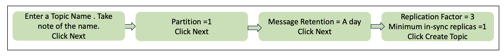
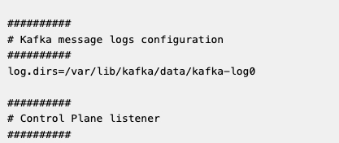
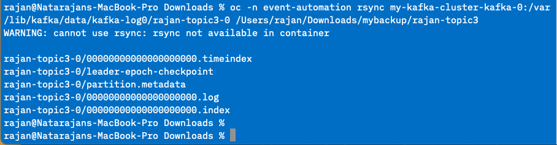
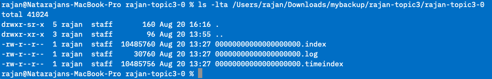

# Backup EventStreams By Copying Logs Folder

## Objective
Make a backup of a source Event Streams. The backup should include all topics data (including Schema Registry). Backed up data will be stored in external storage. Consumer lags are not backed up.  

## Pre-requisite

1. Should have a backup Kafka Cluster - preferably in same versions as source. 
2. KafkaConnect Cluster not needed.
3. An external staging computer from where the backup / restore commands can be executed. Backed up files can be stored either in object storage or local block storage. 
4. The staging computer should have the 'oc' and 'kubectl' CLIs installed.    

## Backup from Source EventStreams

1. Create a topic to be used for this exercise. You can do this from the Event Streams portal. Make sure to use your student-id as prefix for the topic.

	

2. Produce some message to the topic.

		java -jar KafkaClient.jar producer 1000 config.properties.melch

3. Create a local working folder in your computer.   
	> mkdir /Users/rajan/Downloads/mybackup/\<topic-name>   
	> e.g. mkdir /Users/rajan/Downloads/mybackup/rajan-topic3

4. From the OpenShift Console, check the location of the data.  
In the Openshift Console, Go to the event-automation namespace and look for the my-kafka-cluster-kafka-0 config-map.   

> Look for the entry:   
> log.dirs=/var/lib/kafka/data/kafka-log${STRIMZI\_BROKER\_ID}.  
> e.g. /var/lib/kafka/data/kafka-log0/.      
	
	

5. Log in to one of the brokers and check for files in the brokers.  

	`oc -n <NAMESPACE> exec -it <KAFKA-POD-NAME> -c kafka -- ls -lrt /var/lib/kafka/data/kafka-log<BROKER-ID>/`.  
	
	`e.g.  oc -n event-automation exec -it my-kafka-cluster-kafka-0  -c kafka -- ls -lrt /var/lib/kafka/data/kafka-log0/`
	
4. Determine which topics have to be copied. It is not recommended to copy the entire logs_dir as it may contain replica topics. No point copying replica topics as they are just a backup of original topics.   
5. For this example, you will replicate the topic you created earlier in this lab. The topic has 1 partition and 3 replicas. We are going to copy one of the replicas.  

> TO BE DONE ONLY IF THERE ARE MULTIPLE PARTITIONS
> In cases where there are multiple partitions, we have to manually check each broker and determine > which partition should be copied from which broker. This is a sample of how the distribution may > look like:      
> Broker 0 - Partition 0 and 2.  
> Broker 1 - Partition 1 and 2.  
> Broker 2 - Partition 0 and 1.  
> From here we can decide to copy as follows:
> 
> 	Partition 0 from Broker 0   
> 	Partition 1 from Broker 2   
> 	Partition 2 from Broker 1   
>
> We just need to be sure to copy all 3 partitions. From which Broker we are copying it does not   really matter. Leader partition or follower partition also does not matter. We will use 'oc rsync' to copy files. Check [here](https://docs.openshift.com/container-platform/4.10/nodes/containers/nodes-containers-copying-files.html) for full reference of 'oc rsync'.     

6. Copy the respective partitions files of the topic from the respective brokers.   

Command:
`oc -n <name-space> rsync <POD-NAME>:/var/lib/kafka/data/kafka-log<BROKER-ID>/topic-name-<PARTITION-ID> /Users/rajan/Downloads/copy_backup/<topic-name>/  `.  

Partition 0 from Broker 0.  
`oc -n event-automation rsync my-kafka-cluster-kafka-0:/var/lib/kafka/data/kafka-log0/rajan-topic3-0 /Users/rajan/Downloads/mybackup/rajan-topic3  `.  

Partition 1 from Broker 2 [SKIP THIS UNLESS THERE ARE MULTIPLE PARTITIONS].  
`oc -n event-automation rsync my-kafka-cluster-kafka-2:/var/lib/kafka/data/kafka-log2/rajan-topic3-1 /Users/rajan/Downloads/mybackup/rajan-topic3/`.  

Partition 2 from Broker 1 [SKIP THIS UNLESS THERE ARE MULTIPLE PARTITIONS].   
`oc -n event-automation rsync my-kafka-cluster-kafka-1:/var/lib/kafka/data/kafka-log1/rajan-topic3-2 /Users/rajan/Downloads/mybackup/rajan-topic3/`.  

This is how the output should roughly look like:   

7. Check the destination. There should be at least 1 folder (for each partition) and multiple files in these folders.   

		Natarajans-MacBook-Pro rajan-topic3 % ls -lt /Users/rajan/Downloads/mybackup/rajan-topic3               
		drwxr-sr-x  7 rajan  staff  224 Aug 20 13:55 rajan-topic3-0

		Natarajans-MacBook-Pro rajan-topic3 % ls -lt /Users/rajan/Downloads/mybackup/rajan-topic3/rajan-topic3-0 
		-rw-r--r--  1 rajan  staff  10485760 Aug 20 13:27 00000000000000000000.index
		-rw-r--r--  1 rajan  staff     30760 Aug 20 13:27 00000000000000000000.log
		-rw-r--r--  1 rajan  staff  10485756 Aug 20 13:27 00000000000000000000.timeindex
		-rw-r--r--  1 rajan  staff         8 Aug 20 13:24 leader-epoch-checkpoint
		-rw-r--r--  1 rajan  staff        43 Aug 20 13:24 partition.metadata

8. IMPORTANT STEP: Clean up the copied files.   
We don't need all the copied files. We only need files with the following extensions. Delete all other files in the backed up folder.   

		*.index  
		*.log  
		*.timeindex  

This is how the folder should like after clean-up.   
	

## Restore to Target EventStreams

1. Now we will restore the copied files into another EventStreams. For the purpose of the lab, we will restore the topic to an Event Stream instance created in cp4i-eventstreams namespace.  

2. OPTIONAL STEP: This step is only needed if your topic has more than one partition. 
Before copying the partitions to the target cluster, we need to decide on which partition should go into which broker. It is NOT necessary to match the partitions and brokers as they were in the source ES.  In fact, technically, it is possible to restore all 3 partitions in the same broker. For our testing, we will do the following:

		Partition 0 in Broker 0
		Partition 1 in Broker 1
		Partition 2 in Broker 2

3. Copy files to target cluster.  

Command:   

`oc -n <NAMESPACE> rsync /Users/rajan/Downloads/copy_backup/topic-3p-2r/topic-3p-2r-<PARTITION-ID> <POD-NAME>:/var/lib/kafka/data/kafka-log<BROKER-ID>/`

Partition 0 in Broker 0
`oc -n cp4i-eventstreams rsync /Users/rajan/Downloads/mybackup/rajan-topic3/rajan-topic3-0 light-insecure-kafka-0:/var/lib/kafka/data/kafka-log0/`

Partition 1 in Broker 1 [SKIP THIS UNLESS THERE ARE MULTIPLE PARTITIONS]   
`oc -n cp4i-eventstreams rsync /Users/rajan/Downloads/mybackup/rajan-topic3/rajan-topic3-1 light-insecure-kafka-1:/var/lib/kafka/data/kafka-log1/`

Partition 2 in Broker 2 [SKIP THIS UNLESS THERE ARE MULTIPLE PARTITIONS]   
`oc -n cp4i-eventstreams rsync /Users/rajan/Downloads/mybackup/rajan-topic3/rajan-topic3-2 light-insecure-kafka-2:/var/lib/kafka/data/kafka-log2/`

4. Let the target Kafka know about the new topic and it's partition location. This is an important step where we will have to notify kafka about the mapping of the partition and broker.   

Command:
`oc -n <NAME-SPACE> exec -ti <POD Name> -- bin/kafka-topics.sh --bootstrap-server localhost:9092 --create --topic topic-3p-2r  --replica-assignment 0:1:2,1:2:0,2:0:1 --config retention.ms=-1`.  

> 	Explanation of the command:   
> 	**replica-assignment** - to point the leader and replica for each partition. So, the first "0:1:2" represents Partition 0. Leader is Broker 0 where else, 1 and 2 are replicas. So, here we are defining 3 replicas for the topic even though there were only 2 replicas in the source kafka.   
> 	**config retention** - this is the retention period of the messages in topic. A '-1 ' means, no expiry period. This is to ensure older messages do not get deleted.   
> 

This is how the command looks like:   
`oc -n cp4i-eventstreams exec -ti light-insecure-kafka-0 -- bin/kafka-topics.sh --bootstrap-server localhost:9092 --create --topic rajan-topic3  --replica-assignment 0 --config retention.ms=-1`.  

You should get a confirmation that the topic was created.   
	
5. You can now check the Target Kafka and ensure the messages are properly restored. For example, you can check the last offset of the source and target Kafka.    
Click on one of the link below (depending on the OpenShift cluster allocated to you) to log into your destination Event Streams instance. You do not require any login to this instance. 

    | Host | URL |
    | --- | --- |
    | Ventress | [https://light-insecure-ibm-es-ui-cp4i-eventstreams.apps.ventress.coc-ibm.com/](https://light-insecure-ibm-es-ui-cp4i-eventstreams.apps.ventress.coc-ibm.com/) |
    | Melch| [https://light-insecure-ibm-es-ui-cp4i-eventstreams.apps.melch.coc-ibm.com/](https://light-insecure-ibm-es-ui-cp4i-eventstreams.apps.melch.coc-ibm.com/) |
    | POE | [https://light-insecure-ibm-es-ui-cp4i-eventstreams.apps.poe.coc-ibm.com/](https://light-insecure-ibm-es-ui-cp4i-eventstreams.apps.poe.coc-ibm.com/) |  

Browse to the topics. Look for your topic and check the messages. 

