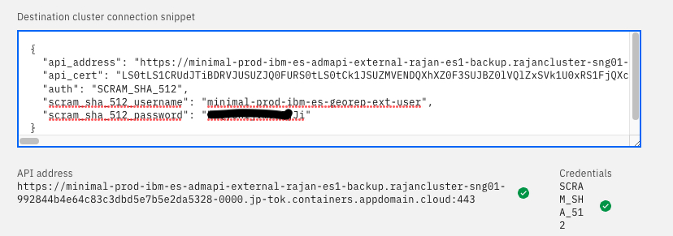

# Backup EventStreams Using IBM GeoReplication

## Objective
Make a backup of a source Event Streams. The backup should include all topics data (including Schema Registry). It is possible to make some modification to the MM2 CR to replicate consumer lags. This document does not cover replication of consumer lags.  

## Pre-requisite

1. Should have a backup Kafka Cluster - preferably in same verions as source. 
2. KafkaConnect Cluster not needed. 

## Setup and Start MM2

### To be done in Target EventStreams Namespace
1. From the OpenShift console, Create a GeoReplication instance in the target EventStreams namespace. You can use the sample yaml file provided [here](./georep.yaml)
2. Take note of the following when creating the GeoRep CR file:   

	> The name of the GeoRep must match the name of ES in the Target EventStreams.   
	The label should also point to the target EventStreams.   

When the process is complete, you should see a MirrorMaker2 instance pod in the target namespace. This may take a few minutes to appear.   

3. Make sure the min.insync.replicas is set to 1 in the target Kafka. This should be sufficient as the target Kafka is only used as backup. However, if you are planning for automated failover to the target cluster, then, you may have to change the number of replicas in the MM2 CR to a suitable value. 
4. From the EventStreams portal, Go to    
`Home -> Connect to this cluster -> Geo Replication `.  
`Choose "I want this cluster to be able to receive topics from another cluster"`
Copy the generated config. 

### To be done in Source EventSreams Namespace

1. From the EventStreams portal, Go to    
`Home -> Connect to this cluster -> Geo Replication `.  
`Choose "I want to replicate topics from this cluster to another cluster"`.  
Paste the copied config. 

2. The config should be validated and you should see a green tick to confirm that the config data is valid.    

3. Click on "Connect Cluster".  

### To be done in Target EventStreams Namespace

1. From the OpenShift Console, Go to    

	> Installed Operators -> IBM-EventStreams -> Kafka Mirror Maker 2 -> Open the yaml view of the CR.  
	
	
	Add these 2 lines:
	`spec.mirrors.sourceConnector.config.replication.policy.class: org.apache.kafka.connect.mirror.IdentityReplicationPolicy`     
	`spec.mirrors.topicPattern: .*`
	
	The first entry ensures that the topics created in target Kafka has the same name as the ones in source Kafka (i.e. no additional prefixes added to it.). The 2nd line replicates ALL topics.    
	
2. Save the CR. This should start the replication of all topics from the source cluster to the target cluster. The replication should also include schema registries. 
3. Check and compare the topics and schema in source and target kafka. 

