# Setting up ES to be monitored from Instana

## Objectives

To understand the important metrics to be viewed from EventStreams. 
Setup alert from Instana. 

## Check General OpenShift properties.

1. Open the Instana portal.  
2. Go to Platforms -> Kubernetes.
3. Search for your cluster and click on it. You should be able to see some general OpenShift statistics.     
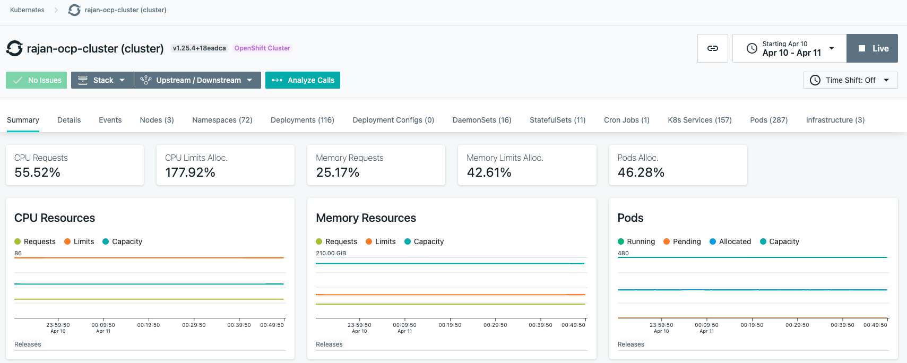
4. You can also get information on specific namespace.
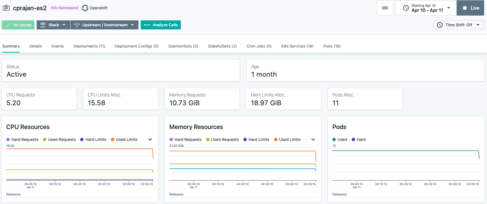
5. You can further drill down to get information about specific pods. 
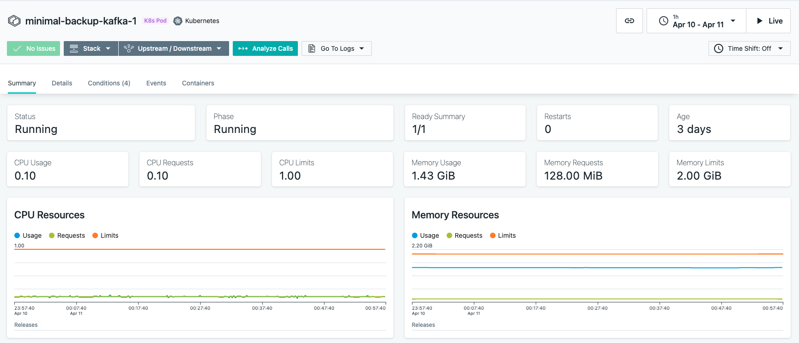
 

## Check EventStreams Specific Details (Cluster Level).
Data to be obtained for the entire EventStreams cluster.   

We will look at the Infrastructure analytics (which is still in Beta).   
1. Open the Instana Portal.
2. Go to Analytics. 
3. From the dropdown choose Infrastructure (Still in Beta). 
4. In the list, look for "Kafka Cluster".   
5. Pick your Kafka Cluster. 

Browse through the page and look for the following details:   
Average Request Latency vs Throughput - Number of messages that arrive in a given amount of time vs time taken to process the messages.   
All Brokers traffic / Broker Failures (Under-Replicated Partitions, ISR Shrinks, ISR Expansions, Active Controller count).   
Cluster nodes.   
Partitions per node.   
Consumer Group Lags.   
Producer / Consumer Metrics (requires producer / consumer to be enabled).   
   

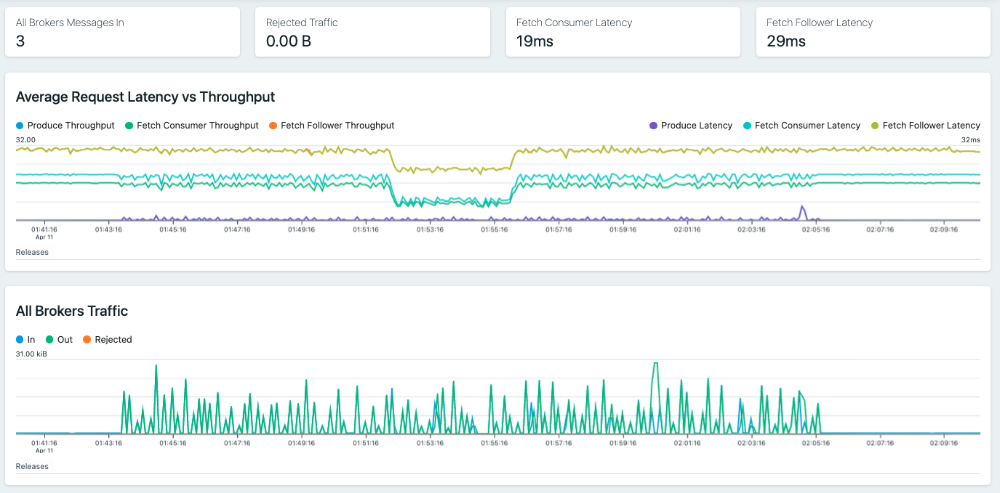
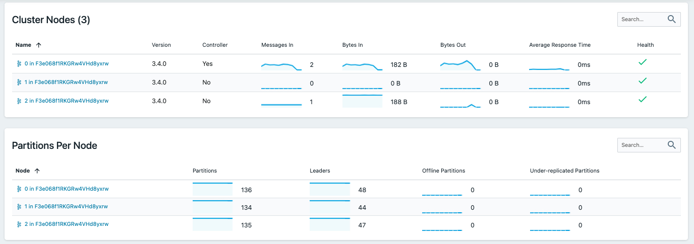
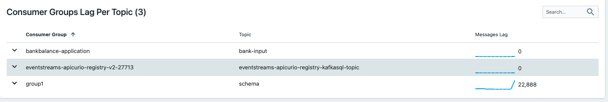

## Check EventStreams Specific Details (Individual Node).
Data to be obtained from each node.   

1. Open the Instana portal.  
2. Go to Platforms -> Kubernetes.
3. Search for your cluster and click on it. You should be able to see some general OpenShift statistics.     
4. Choose the Infrastructure tab.   Choose one of the Worker Nodes.   
5. Scroll Down and look for "Kafka Nodes". Click on the Kafka Cluster name.   

Browse through the page and look for the following details. Details are similar to what we saw for the cluster except - it is broken down to each node:   
Produce Latency - Latency for producing messages.    
Fetch Consumer Latency - Latency for consuming messages.   
Fetch Follower Latency - Latency for Follower broker replications.   
Broker Traffic / Broker Failures (Under-Replicated Partitions, ISR Shrinks, ISR Expansions, Active Controller count).   
Log Flush latency - latency to flush cached data to physical storage.   
Partitions.   
Topics (with summary of Bytes in/out).   
 

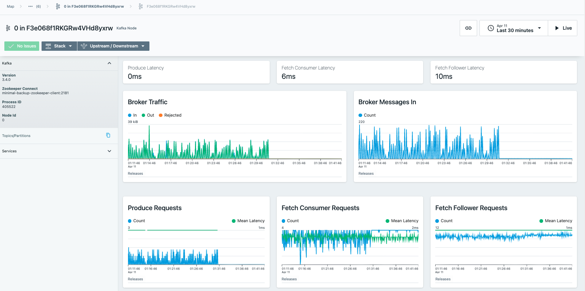
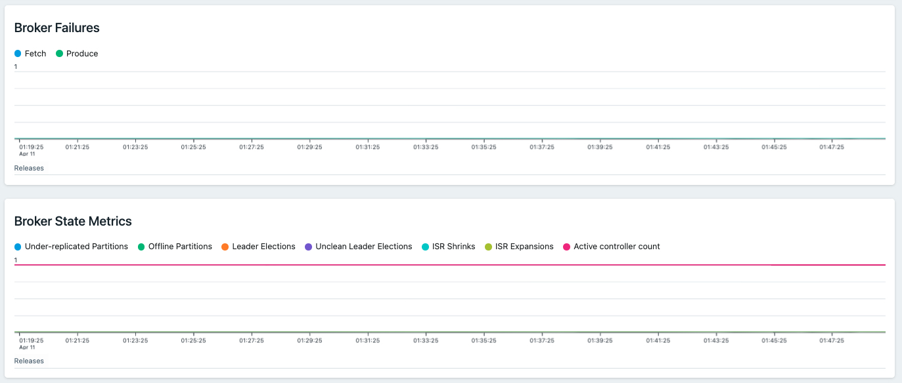
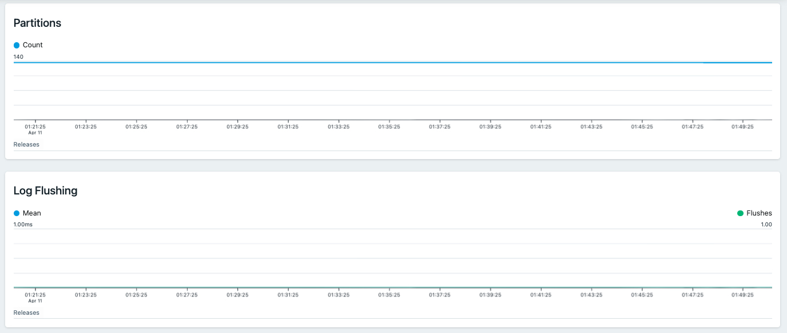
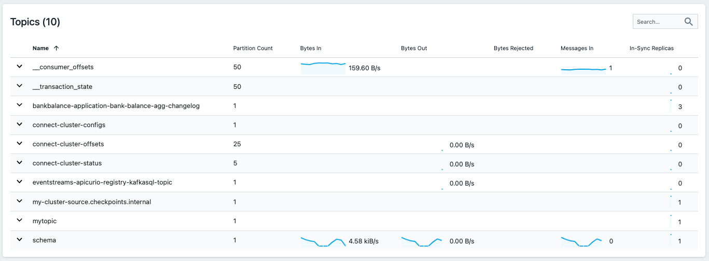

## Setup Alerts
Instana supoprts sending alerts based on events.   
The steps for setting up alerts:   

* Define a alerting Channel.   
* Create and event.   
* Create Custom Payload (Optional).   
* Create an alert.    

### Define Alert Channel
1. Open the Instana portal.  
2. Go to Settings -> Alert Channel -> Add Alert Channel. This is a sample Email alert-channel.   
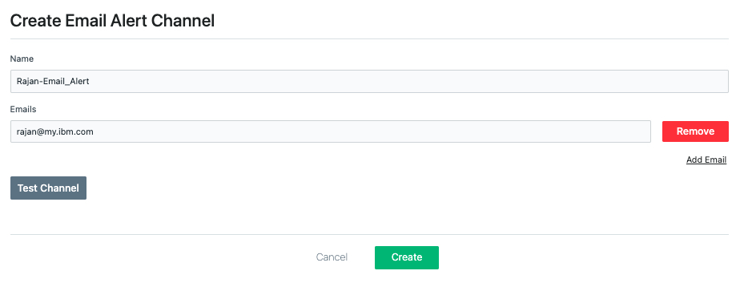

### Create an Event

1. Open the Instana portal.  
2. Go to Settings -> Events -> Create New Event.   
This is where we need to create the event that needs to be alerted. As an example, we will create an event with severity 'warning' by monitoring the Metric "Produce Throughput". Alert will be created if this metric value goes higher than 50. We will monitor only the specific namespace. See this as a sample.  
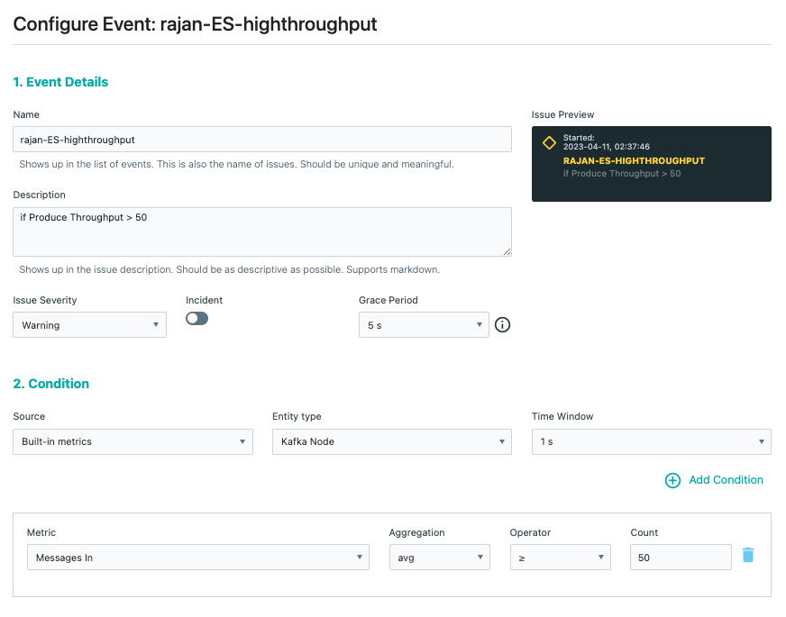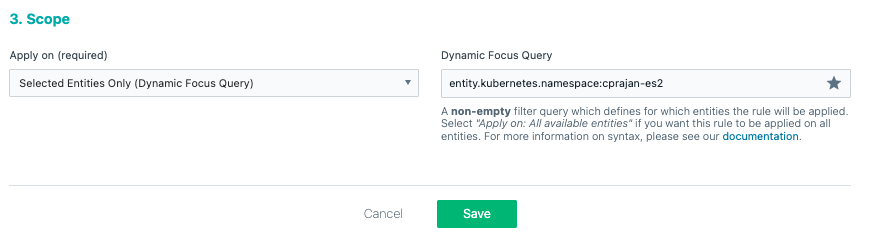

For more information on  [Dynamic Focus Query](https://www.ibm.com/docs/en/instana-observability/current?topic=instana-filtering-dynamic-focus#syntax)    

### Create Custom Payloads 
This step is optional. You can inlcude some additional information in the alert body.   
Settings -> Custom Payload -> Add Row.   
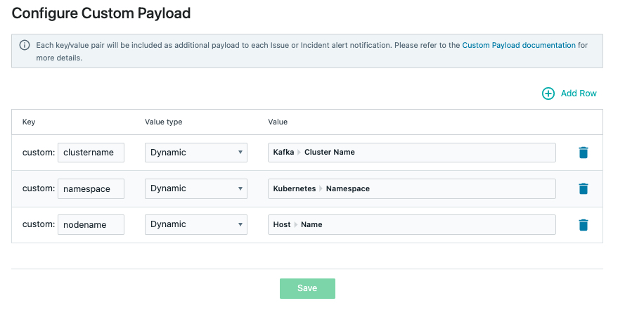

### Create Alert

This is where we will map the event, alert-channel and custom payloads and enable the alerting step.   
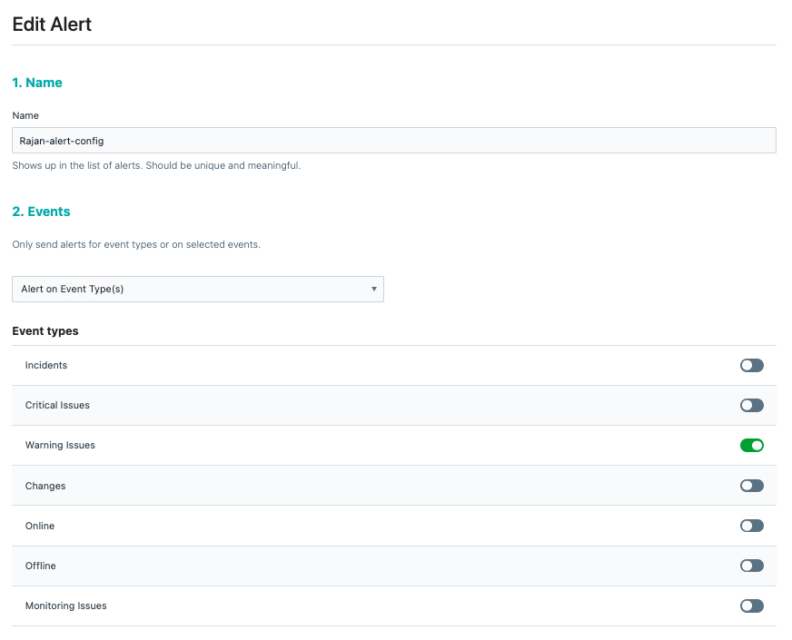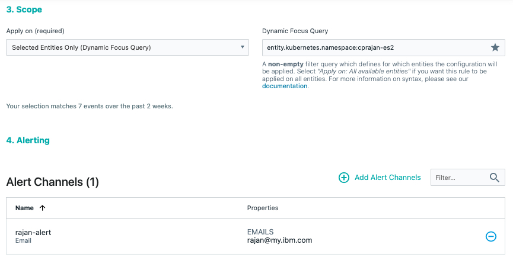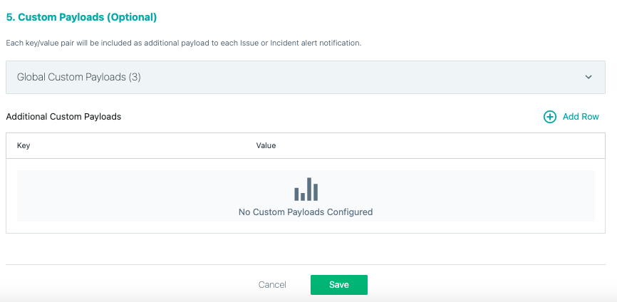

### Test Alert

Produce some messages to Kafka. When the number of messages produced reaches 50 per second, and alert email will be sent.   
This is a sample message.  This message should normally be followed by another message stating that the issue was closed once the number of messages drops below 50 for a few minutes.   

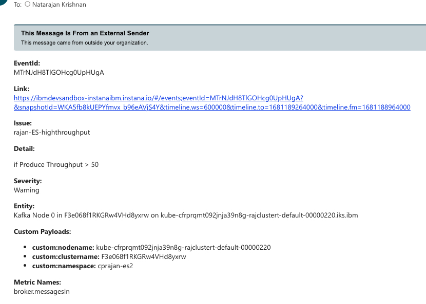

