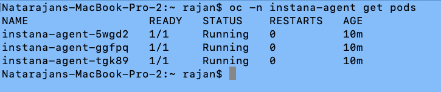

# Setting up ES to be monitored from Instana

## Objectives

View Kafka metrics in Instana.

## Pre-Requisites

* Working instance of Event Streams.
* Access to a pre-installed Instana instance. 

## Obtain connectivity details from Instana

1. We need to obtain some details from Instana. This information will be used when installing the Instana agent in the Openshift Cluster.    
You can use any existing Instana environment. Foir this demo, I'll be using a Instana Sandbox service.   
The URL of the Instana to be used: [https://ibmdevsandbox-instanaibm.instana.io/](https://ibmdevsandbox-instanaibm.instana.io/).  

2. Open the Instana portal. 
Click on "Deploy Agents" -> "OpenShift".  
.  

3. Select Operator as the Technology.  
	Take note of the following 3 details:  
 
		Instana Service Endpoint.  
		Instana Service Port.  
		Instana Application Key.  

	
	
## Install Instana Operator in OpenShift

1. Create a namespace (instana-agent) and set appropriate policy permissions.   

		oc new-project instana-agent  
		oc adm policy add-scc-to-user privileged -z instana-agent -n instana-agent  
 
2. Install the Instana Operator from Openshift Console.   
Go to Operator Hub and install the Instana operator. Install in "All Namespaces". Leave all fields to default. Wait for the Operator installation to complete.    
.  

3. Wait for the Operator installation to complete.

## Deploy an instance of the Instana Agent

1. Open "Installed Operators" page and select instana-agent namespace. Click on "Create Instance".   
2. Go to the YAML view and change the following lines. Refer [here](./instana-agent.yaml) for a sample yaml.   

		Add this section:
		    configuration_yaml: |
		      com.instana.plugin.kafka:
		        enabled: true
		        collectLagData: true
		
		Change this section to the correct values that was copied.   
		    endpointPort: '443'
		    endpointHost: ingress-orange-saas.instana.io
		    key: xxxxxxxxxxxxxxxxx

Click on "Create Instance".   
Wait for the agent to be started. There shold be a few agent pods in running state.  

	oc -n instana-agent get pods

*Note: The agent will connect to Kafka on the unsecured listener by default. If your Kafka does not have one, you can use a Mutual TLS enabled listener. Refer [here](./instana-agent-mtls.yaml) for a sample yaml.   *

## Check the Agent from Instana portal.

1. Open the Instana portal.  
2. Go to Platforms -> Kubernetes.
3. Search for your cluster and click on it. You should be able to see some general OpenShift statistics.     
4. Choose the Infrastructure tab.   Choose one of the Worker Nodes.   
5. Scroll Down and look for "Kafka Cluster". Click on the Kafka Cluster name.   

Browse through the page and look for the following details.

You can also look at the Infrastructure analytics (which is still in Beta).   
1. Open the Instana Portal.
2. Go to Analytics. 
3. From the dropdown choose Infrastructure. 
4. In the list, look for "Kafka Cluster".   
5. Pick your Kafka Cluster. 

Browse through the page and look for the following details.

