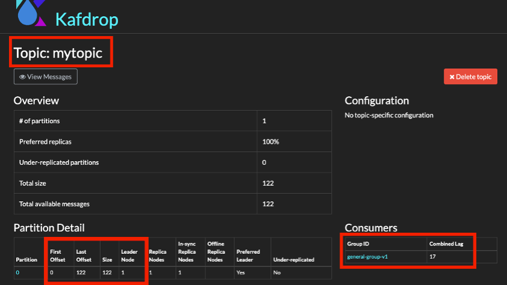
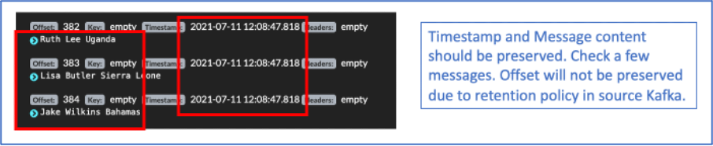
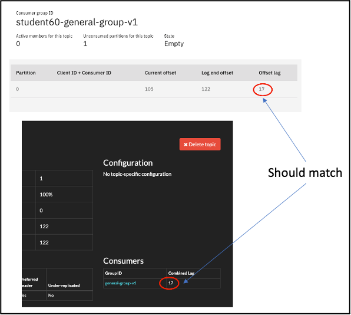
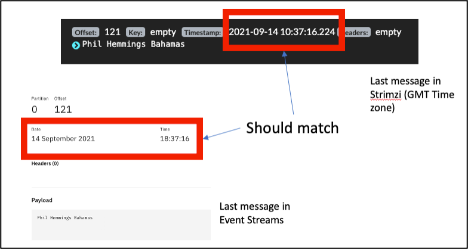

# Configuring and Running MirrorMaker 2 (MM2)

## Objectives

Make a replication of a source Kafka (Not Event Streams) to an EventStreams Kafka. As part of the demo, we will backup topics and consumer lags.  

## Pre-Requisites

* Working instance of Event Streams.
* A source Kafka cluster (e.g. Strimzi).

## Setup and Start MM2

1. Take note of Source Kafka details. If you do not have your own Kafka instance, you can use this strimzi instance. 

[https://strimzi-cprajan-strimzi.rajcluster-tok05-b3c-16x6-992844b4e64c83c3dbd5e7b5e2da5328-0000.jp-tok.containers.appdomain.cloud/](https://strimzi-cprajan-strimzi.rajcluster-tok05-b3c-16x6-992844b4e64c83c3dbd5e7b5e2da5328-0000.jp-tok.containers.appdomain.cloud/)

Take note of the topic name, consumer group, consumer lags and last offset message. 

2. Create a MM2 CR.   
Login to the Openshift Console. 
Go to "Installed Operators" -> IBM Event Streams -> Kafka Mirror Maker 2.  
Click on "Create Kafka MirrorMaker2:.   
You can use the sample [here](./mm2.yaml) as a guide. 

3. Check and change the following parameters in the CR 

name - Name of the MM2 instance    

bootstrapServer (source) - Bootstrap URL of the source Strimzi cluster. You can use this. 
	`rajcluster-tok05-b3c-16x6-992844b4e64c83c3dbd5e7b5e2da5328-0000.jp-tok.containers.appdomain.cloud:31496`

bootstrapServers (target) - Bootstrap URL of the target Event Stream Cluster. For the purpose of this lab, you can use a PLAIN connection.    
	`minimal-backup-ibm-es-kp-bootstrap.cprajan-es2.svc:9092`

topicsPattern - list of topics to be replicated.   

groupsPattern: list of consumer groups to be replicated.  [ Use .* for all groups ]

sourceConnector - add the following lines:   
>           sync.topic.acls.enabled: 'false'.  
>           replication.policy.class: org.apache.kafka.connect.mirror.IdentityReplicationPolicy

This will maintain the topics name is source and target without adding any prefix.   

checkpointConnector - add the following lines:   
>           emit.checkpoints.enabled: true  
>           refresh.groups.interval.seconds: 60  
>           sync.group.offsets.enabled: true  
>           replication.policy.class:    org.apache.kafka.connect.mirror.IdentityReplicationPolicy  

4. Once the CR file is ready, click on create. This will create a MirrorMaker2 instance and it will also start replicating topics and consumer lags. 

5. Verify the replication (topics).   
Check the EventStreams web console and a new topic should have been created. 
Look for the replicated topic. 

6. Verify the replication (consumer lags)

Check consumer lags in Event Streams. 

* Go to Event Streams home page -> Topics -> Click on the replicated topic -> Click on “Consumer Groups”.

The new consumer group should appear and the offset lag should match with that of strimzi. 

* Do a random check on the timestamp of a message. 

