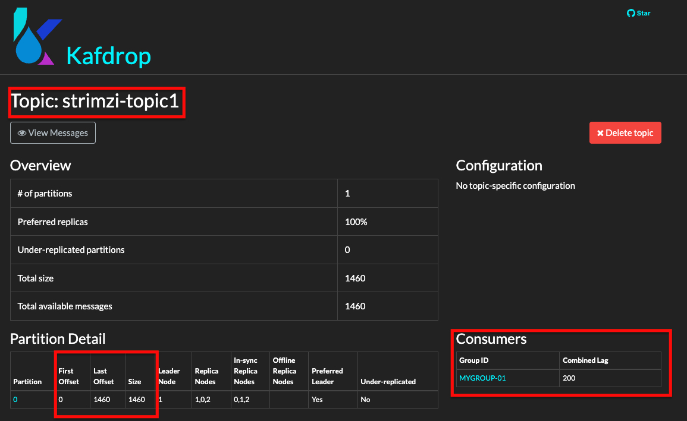
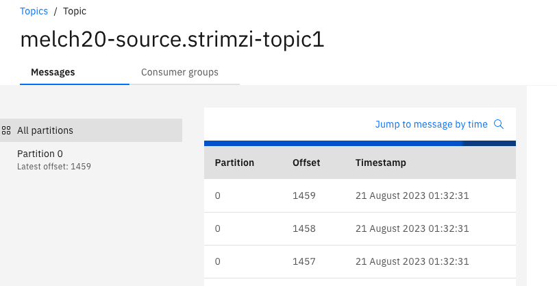
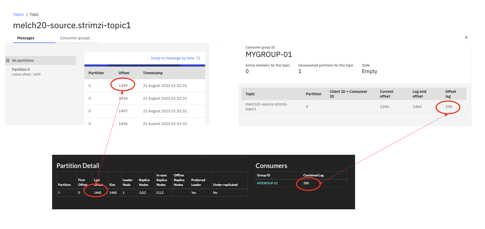

# Configuring and Running MirrorMaker 2 (MM2)

## Objectives

Make a replication of a source Kafka (Not Event Streams) to an EventStreams Kafka. As part of the demo, we will backup topics and consumer lags.  

## Pre-Requisites

* Working instance of Event Streams.
* A source Kafka cluster (e.g. Strimzi).

## Setup and Start MM2

1. Take note of Source Kafka details. If you do not have your own Kafka instance, you can use this strimzi instance. 

[https://strimzi-cprajan-strimzi.rajcluster-tok05-b3c-16x6-992844b4e64c83c3dbd5e7b5e2da5328-0000.jp-tok.containers.appdomain.cloud/](https://strimzi-cprajan-strimzi.rajcluster-tok05-b3c-16x6-992844b4e64c83c3dbd5e7b5e2da5328-0000.jp-tok.containers.appdomain.cloud/)

Take note of the topic name, consumer group, consumer lags and last offset message. 

2. Create a MM2 CR.   
Download the sample yaml file from  [here](./mm2.yaml).   
Edit the yaml and replace all instances of \<student-id> with your actual student-id.    
Take a look and understand the following important fields (no changes needed)   

		sync.group.offsets.enabled: should be true to replicate consumer lags.  
		Source bootstrapServer: the bootstrap URL of the source strimzi server.
		Destination bootstrapServer: the bootstrap server of the destination Kafka.
		topicsPattern: the topic in strimzi that will be replicated. Wild card permitted. 
		groupsPattern: the consumer groups that should be replicated. 

		The following fields are useful but are not used in our labs:
		replication.policy.class: org.apache.kafka.connect.mirror.IdentityReplicationPolicy. This will maintain the topics name is source and target without adding any prefix.

3. Create the MM2 instance.   
Login to the Openshift Console. 
Go to "Installed Operators" -> IBM Event Streams -> Kafka Mirror Maker 2.  
Click on "Create Kafka MirrorMaker2:.   
Paste the CR (yaml file) you created in the above step. 
Click on create.

4. This will create a MirrorMaker2 instance and it will also start replicating topics and consumer lags. 

5. Verify the replication (topics).   
Check the EventStreams web console and a new topic should have been created. 
Look for the replicated topic.    
A prefix will be added to the topic name.   

6. Verify the replication (consumer lags)

Check consumer lags in Event Streams. 

* Go to Event Streams home page -> Topics -> Click on the replicated topic -> Click on “Consumer Groups”.

The new consumer group should appear and the offset lag should match with that of strimzi. 

* Do a random check on the timestamp of a message. 

Great. You have sucessfully replicated a topic and consumer group lags from Strimzi to Event Streams.   

