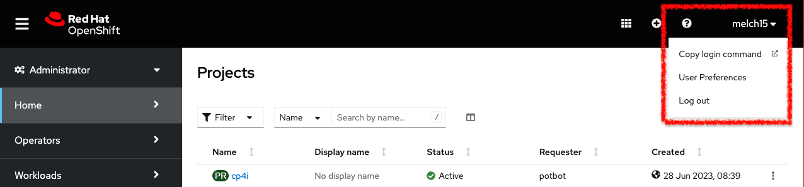

# Monitoring Event Streams

## Objectives

The Event Streams UI provides information about the health of your environment at a glance. In this lab, you will find out what are the important aspects of EventStreams that has to be monitored and how to monitor them from the native EventStreams portal.   
It is also possible to integrate Event Streams metrics with external monitoring / observing systems (e.g. Instana). 

## Pre-Requisites

* Working instance of Event Streams with Monitoring metrics activated.

## Glance Through the Monitoring Capabilities

1. Click one of the following links (depending on the OpenShift cluster allocated to you) to log into your OpenShift Console. Use the student credentials provided. 

    | Host | URL |
    | --- | --- |
    | Ventress | [https://console-openshift-console.apps.ventress.coc-ibm.com/](https://console-openshift-console.apps.ventress.coc-ibm.com/) |
    | Melch| [https://console-openshift-console.apps.melch.coc-ibm.com/](https://console-openshift-console.apps.melch.coc-ibm.com/) |
    | POE | [https://console-openshift-console.apps.poe.coc-ibm.com/](https://console-openshift-console.apps.poe.coc-ibm.com/) |  

2. Change to the "Administrator Portal". 

3. Install the 'oc' CLIs in your laptop (If Not done yet)   

Download the 'oc' CLI from your cluster and install it if you have not installed it yet.  

| Host | URL |
| --- | --- |
| Ventress | [https://console-openshift-console.apps.ventress.coc-ibm.com/command-line-tools](https://console-openshift-console.apps.ventress.coc-ibm.com/command-line-tools) |
| Melch| [https://console-openshift-console.apps.melch.coc-ibm.com/command-line-tools](https://console-openshift-console.apps.melch.coc-ibm.com/command-line-tools) |
| POE | [https://console-openshift-console.apps.poe.coc-ibm.com/command-line-tools](https://console-openshift-console.apps.poe.coc-ibm.com/command-line-tools) |    

3. Click on the username (top-right) and choose "Copy Login Command". Enter the same student username / password again. Then, click on "Display Token"

4. Copy the “Log in with this token” command.

5. Open a Windows Command Prompt (or MAC terminal) and paste the command. Add this option at the end of your command:   

		--insecure-skip-tls-verify=true

You should be logged in to OpenShift. 

6. Check the status of the pods.   

		oc -n event-automation get pods 

		All pods should be in either Running or Completed state. There should not be any frequent restarts. If there were any pods not in running state, check the status:

		oc -n es describe pods <pod_name>
		oc -n es logs <pod_name>

7. Click on one of the link below (depending on the OpenShift cluster allocated to you) to log into your Event Streams instance using the student credentials provided. Once you've logged in, you'll see the Event Streams homepage.

    | Host | URL |
    | --- | --- |
    | Ventress | [https://cpd-cp4i.apps.ventress.coc-ibm.com/integration/kafka-clusters/event-automation/my-kafka-cluster/](https://cpd-cp4i.apps.ventress.coc-ibm.com/integration/kafka-clusters/event-automation/my-kafka-cluster/) |
    | Melch| [https://cpd-cp4i.apps.melch.coc-ibm.com/integration/kafka-clusters/event-automation/my-kafka-cluster/](https://cpd-cp4i.apps.melch.coc-ibm.com/integration/kafka-clusters/event-automation/my-kafka-cluster/) |
    | POE | [https://cpd-cp4i.apps.poe.coc-ibm.com/integration/kafka-clusters/event-automation/my-kafka-cluster/](https://cpd-cp4i.apps.poe.coc-ibm.com/integration/kafka-clusters/event-automation/my-kafka-cluster/) |  

8. Monitoring Event Streams Statistics   
Once logged in to the EventStreams portal, click on ‘Monitoring’ (on the left). Scroll down and look for the following:      

	<u>Under Replicated Partitions </u>   
	In cases when there are multiple replicas for a certain partition, it is expected that all replicas are up to date with the latest message in the leader partition. In case if there was a problem (e.g. with the pod carrying one of the replicas), then, that partition will be highlighted as under replicated.    

	<u>Partitions below minimum in-sync replicas</u>   
	This is the minimum number of replicas that must be in-sync before Kafka commits a message and notifies producers. Any partition below the number of minimum in-sync replicas may face message loss. The value should normally be 0 indicating all partitions have the minimum number of in-sync replicas.  The value should normally be 0 indicating all partitions are replicated correctly.   

	<u>Incoming bytes / Outgoing bytes </u>   
	Shows the throughput performance of the EventStreams cluster. A number that should be monitored regularly to understand the utilization of the Kafka platform and plan for upgrades. 

 
 

9. Consumer Lag   
This refers to a scenario where certain consumers are far behind in terms of consuming messages from topic. Kafka keeps messages in memory before flushing them to disk. If consumers take too long to consume messages, then, the messages may have to be read from disks to be delivered – hence increasing disk io.    
Login to the EventStreams portal. Go to topics. Click on any one of the topics. Click on Consumer Groups. You should see the consumer groups consuming messages from this topic. Click on one of the consumer groups and you will see the consumer lags for the specific consumer group.

 
 

10. Monitor EventStreams Components Health   
The Event Streams UI provides information about the health of your environment at a glance. In the bottom right corner of the UI, a message shows a summary status of the system health. If there are no issues, the message states System is healthy.

	 

11. Instana   
**Instana** can be used for monitoring OpenShift and also for observing EventStreams (Kafka) metrics. 
We will not do this as part of the lab. However, you can refer here for more information.   
Refer here on how to setup EventStreams to be monitored by Instana.   
[https://ibmintegration.github.io/ibm-event-streams/instana.html](https://ibmintegration.github.io/ibm-event-streams/instana.html)   
Refer here on what to monitor and how to setup alerts in Instana.   
[https://ibmintegration.github.io/ibm-event-streams/instana-es-metrics.html](https://ibmintegration.github.io/ibm-event-streams/instana-es-metrics.html)

