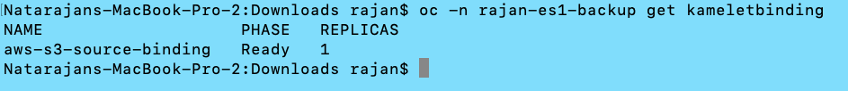

# Backup EventStreams Using Camel S3 Connector

## Objective
Make a backup of a source Event Streams. The backup should include all topics data (including Schema Registry). Backed up data will be stored in IBM COS. Consumer lags are not backed up.  

## Pre-requisite

1. Should have a backup Kafka Cluster - preferably in same verions as source. 
2. KafkaConnect Cluster not needed.
3. Camel-K Community Operator installed

## Setup Camel-K

### To be done in Both (Source and Target) EventStreams Namespace
1. Install the Camel-K Community Operator from Operator Hub (if not done yet). Once installed, you should be able to see a list of installed Kamelets. 

	`oc -n <NAMESPACE> get Kamelet`
	
2. In the list displayed, make sure the following 2 Kamelets are listed as we will be using them.   

> aws-s3-sink.  
> asw-s3-source	   

### To be done in the Source Namespace

This is the step to backup the contents to Object Storage. 

3. Create a s3-sink KamletBinding. You can use the sample KamletBinding yaml file provided [here](./aws-s3-sink-bind.yaml). Create the KamletBinding.  
`oc -n <NAME-SPACE> apply -f <yaml file>`    

4. The process will take some time (about 5 minutes) before you see some new pods. If it's successful, you should see at least 2 new pods.  
	> One build pod in completed state.   
	One sink-binding pod in running state.   
	
.  

You can also check the status of the KameletBinding.   

	oc -n <NAMESPACE> get kameletbinding.  

.  

### To be done in the Target Namespace

This is the step to restore the contents from Object Storage to Kafka Topic.   

1. Create a s3-source KamletBinding. You can use the sample KamletBinding yaml file provided [here](./aws-s3-source-bind.yaml). Create the KamletBinding.  
`oc -n <NAME-SPACE> apply -f <yaml file>`    

2. The process will take some time (about 5 minutes) before you see some new pods. If it's successful, you should see at least 2 new pods.  
	> One build pod in completed state.   
	One sink-binding pod in running state.   
	
.  

You can also check the status of the KameletBinding.   

	oc -n <NAMESPACE> get kameletbinding.  

.  

